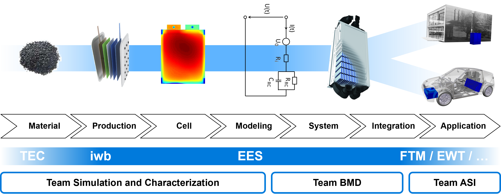

# Welcome 🙌

### About Us 👥
Welcome to the GitHub organization of the [Chair of Electrical Energy Storage Technology](https://www.epe.ed.tum.de/en/ees/homepage/) at the Technical University of Munich (TUM). We deal with electrical energy storages, mainly with rechargeable batteries. Along with lithium ion batteries, also systems such as sodium ion and solid state batteries play an important part.

### Resources 📚
We maintain extensive documentation and resources to support your work:

- **[Chair of Electrical Energy Storage Technology](https://www.epe.ed.tum.de/en/ees/homepage/)**: Visit our website to learn more about our research, ongoing projects, and latest publications.
- **Project-Specific Docs**: Each repository includes a `README` with specific details about the project, including setup instructions, contribution guidelines, and technical references.

#### For External Contributors 🌍

1. **Identity Verification**: External contributions will only be considered if the contributor uses their real name and an authentic profile picture. This ensures accountability and trustworthiness in all external contributions.

2. **Forking the Repository**: External contributors fork the repository and work on changes in their own branches.

3. **Submit a Pull Request**: Once your work is complete, submit a pull request for review. Ensure that your branch is up to date with the main branch before submitting.

4. **Compliance**: Contributions from external contributors that do not adhere to these guidelines may not be accepted.

#### References and Best Practices 📜

- We align our guidelines with the [GitHub Acceptable Use Policies](https://docs.github.com/en/site-policy/acceptable-use-policies) which stress the importance of authenticity and transparency in user profiles.
- For more insights on contributing to open-source projects, we recommend reviewing the [Open Source Guides by GitHub](https://opensource.guide/).

#### Contribution Process 🔄
1. **External contributors only**: Fork the Repository and create a branch.
2. **Create a feature branch**: Work on your changes in a separate branch.
3. **Submit a pull request**: Once your work is complete, submit a pull request for review.

Thank you for your contributions and for helping us maintain a high standard of quality and trust in this project.
